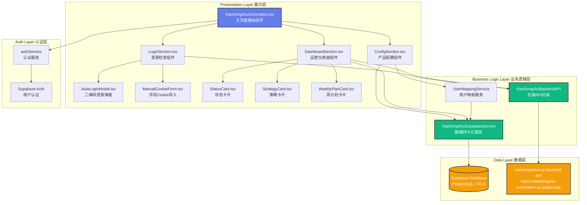
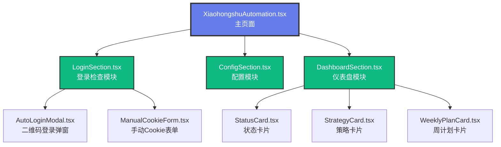
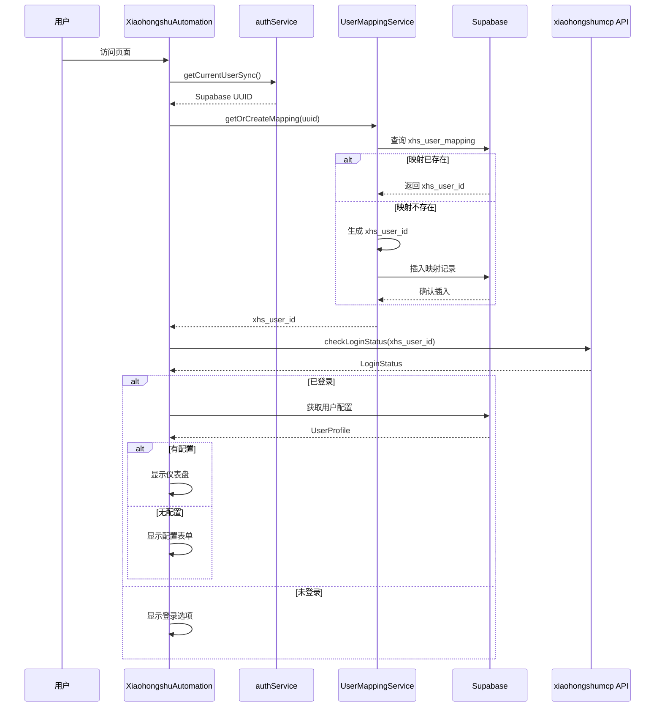
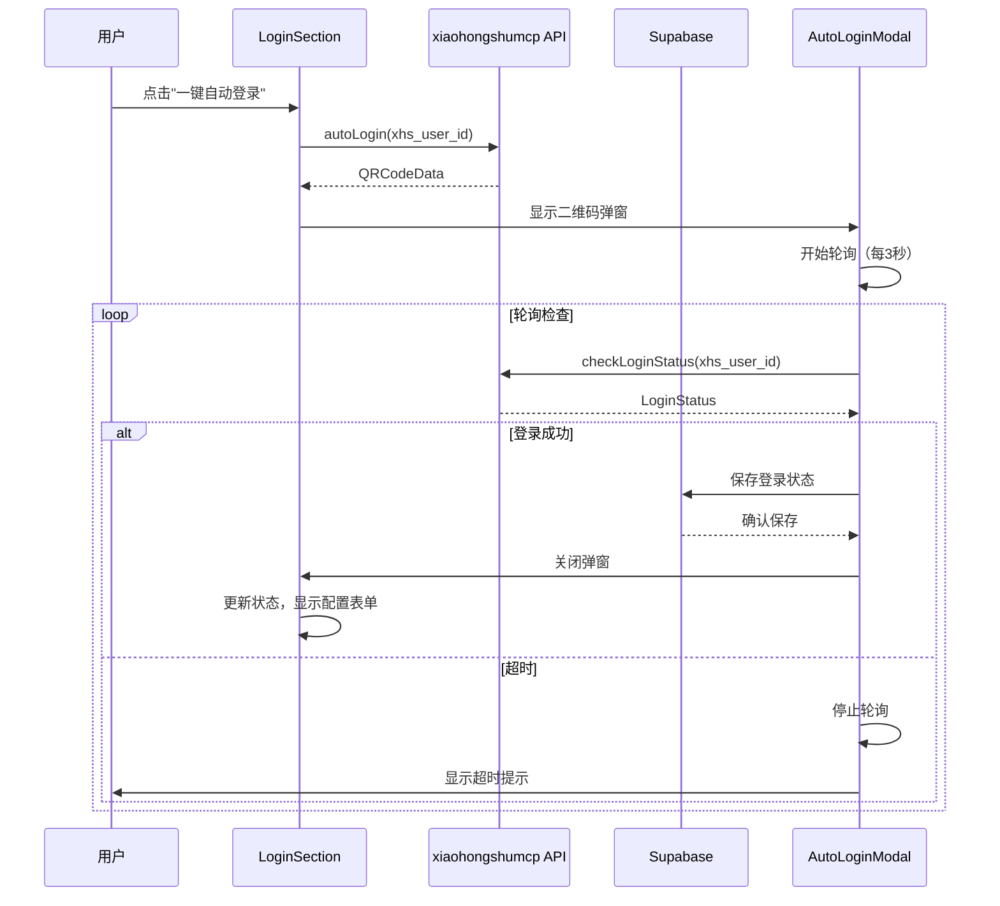
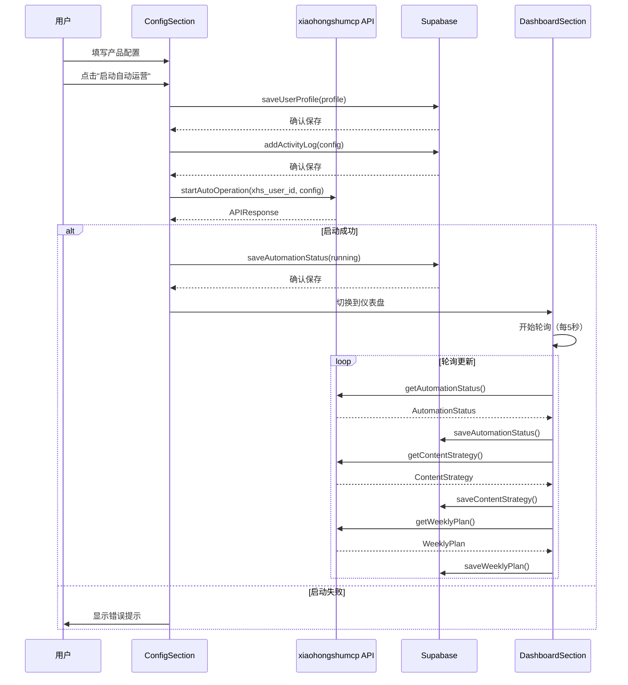

# 小红书自动化系统集成 - 架构设计文档

> **基于**：CONSENSUS_xiaohongshu_integration.md  
> **状态**：🏗️ 架构设计中  
> **日期**：2025-10-31

---

## 📐 整体架构设计

### 系统分层架构



---

## 🧩 核心模块设计

### 1. 用户映射服务 (UserMappingService)

```typescript
// src/lib/xiaohongshu-user-mapping.ts

/**
 * 用户ID映射服务
 * 负责 Supabase UUID 与 xhs_user_id 的转换和持久化
 */
export class UserMappingService {
  private readonly supabaseService: XiaohongshuSupabaseService;

  constructor() {
    this.supabaseService = new XiaohongshuSupabaseService();
  }

  /**
   * 生成小红书用户ID
   * 格式：user_{前16位UUID}_prome
   */
  private generateXhsUserId(supabaseUuid: string): string {
    const cleanId = supabaseUuid.replace(/-/g, '').substring(0, 16);
    return `user_${cleanId}_prome`;
  }

  /**
   * 获取或创建用户映射
   * 如果不存在则自动创建
   */
  async getOrCreateMapping(supabaseUuid: string): Promise<string> {
    // 1. 尝试从数据库获取
    const existing = await this.supabaseService.getUserMapping(supabaseUuid);
    if (existing) {
      return existing.xhs_user_id;
    }

    // 2. 生成新的映射
    const xhsUserId = this.generateXhsUserId(supabaseUuid);
    
    // 3. 保存到数据库
    await this.supabaseService.createUserMapping({
      supabase_uuid: supabaseUuid,
      xhs_user_id: xhsUserId
    });

    return xhsUserId;
  }

  /**
   * 验证映射是否存在
   */
  async validateMapping(supabaseUuid: string): Promise<boolean> {
    const mapping = await this.supabaseService.getUserMapping(supabaseUuid);
    return mapping !== null;
  }
}
```

---

### 2. Supabase 数据服务 (XiaohongshuSupabaseService)

```typescript
// src/lib/xiaohongshu-supabase.ts

import { supabase } from './supabase';
import type { 
  UserMapping, 
  UserProfile, 
  AutomationStatus,
  ContentStrategy,
  WeeklyPlan,
  ActivityLog 
} from '@/types/xiaohongshu';

/**
 * Supabase 数据库操作服务
 * 封装所有与 Supabase 交互的逻辑
 */
export class XiaohongshuSupabaseService {
  
  // ============================================
  // 用户映射管理
  // ============================================
  
  async getUserMapping(supabaseUuid: string): Promise<UserMapping | null> {
    const { data, error } = await supabase
      .from('xhs_user_mapping')
      .select('*')
      .eq('supabase_uuid', supabaseUuid)
      .single();

    if (error && error.code !== 'PGRST116') {
      console.error('Error fetching user mapping:', error);
      throw new Error('Failed to fetch user mapping');
    }

    return data;
  }

  async createUserMapping(mapping: Omit<UserMapping, 'created_at' | 'updated_at'>): Promise<void> {
    const { error } = await supabase
      .from('xhs_user_mapping')
      .insert(mapping);

    if (error) {
      console.error('Error creating user mapping:', error);
      throw new Error('Failed to create user mapping');
    }
  }

  // ============================================
  // 用户配置管理
  // ============================================

  async getUserProfile(supabaseUuid: string): Promise<UserProfile | null> {
    const { data, error } = await supabase
      .from('xhs_user_profiles')
      .select('*')
      .eq('supabase_uuid', supabaseUuid)
      .single();

    if (error && error.code !== 'PGRST116') {
      console.error('Error fetching user profile:', error);
      throw new Error('Failed to fetch user profile');
    }

    return data;
  }

  async saveUserProfile(profile: Partial<UserProfile>): Promise<void> {
    const { error } = await supabase
      .from('xhs_user_profiles')
      .upsert(profile, {
        onConflict: 'supabase_uuid'
      });

    if (error) {
      console.error('Error saving user profile:', error);
      throw new Error('Failed to save user profile');
    }
  }

  // ============================================
  // 自动化状态管理
  // ============================================

  async getAutomationStatus(supabaseUuid: string): Promise<AutomationStatus | null> {
    const { data, error } = await supabase
      .from('xhs_automation_status')
      .select('*')
      .eq('supabase_uuid', supabaseUuid)
      .single();

    if (error && error.code !== 'PGRST116') {
      console.error('Error fetching automation status:', error);
      throw new Error('Failed to fetch automation status');
    }

    return data;
  }

  async saveAutomationStatus(status: Partial<AutomationStatus>): Promise<void> {
    const { error } = await supabase
      .from('xhs_automation_status')
      .upsert(status, {
        onConflict: 'supabase_uuid'
      });

    if (error) {
      console.error('Error saving automation status:', error);
      throw new Error('Failed to save automation status');
    }
  }

  // ============================================
  // 内容策略管理
  // ============================================

  async getContentStrategy(supabaseUuid: string): Promise<ContentStrategy | null> {
    const { data, error } = await supabase
      .from('xhs_content_strategies')
      .select('*')
      .eq('supabase_uuid', supabaseUuid)
      .order('created_at', { ascending: false })
      .limit(1)
      .single();

    if (error && error.code !== 'PGRST116') {
      console.error('Error fetching content strategy:', error);
      throw new Error('Failed to fetch content strategy');
    }

    return data;
  }

  async saveContentStrategy(strategy: Partial<ContentStrategy>): Promise<void> {
    const { error } = await supabase
      .from('xhs_content_strategies')
      .insert(strategy);

    if (error) {
      console.error('Error saving content strategy:', error);
      throw new Error('Failed to save content strategy');
    }
  }

  // ============================================
  // 周计划管理
  // ============================================

  async getWeeklyPlan(supabaseUuid: string, weekStartDate: string): Promise<WeeklyPlan | null> {
    const { data, error } = await supabase
      .from('xhs_weekly_plans')
      .select('*')
      .eq('supabase_uuid', supabaseUuid)
      .eq('week_start_date', weekStartDate)
      .single();

    if (error && error.code !== 'PGRST116') {
      console.error('Error fetching weekly plan:', error);
      throw new Error('Failed to fetch weekly plan');
    }

    return data;
  }

  async getCurrentWeekPlan(supabaseUuid: string): Promise<WeeklyPlan | null> {
    const { data, error } = await supabase
      .from('xhs_weekly_plans')
      .select('*')
      .eq('supabase_uuid', supabaseUuid)
      .order('week_start_date', { ascending: false })
      .limit(1)
      .single();

    if (error && error.code !== 'PGRST116') {
      console.error('Error fetching current week plan:', error);
      throw new Error('Failed to fetch current week plan');
    }

    return data;
  }

  async saveWeeklyPlan(plan: Partial<WeeklyPlan>): Promise<void> {
    const { error } = await supabase
      .from('xhs_weekly_plans')
      .upsert(plan, {
        onConflict: 'supabase_uuid,week_start_date'
      });

    if (error) {
      console.error('Error saving weekly plan:', error);
      throw new Error('Failed to save weekly plan');
    }
  }

  // ============================================
  // 活动日志管理
  // ============================================

  async addActivityLog(log: Omit<ActivityLog, 'id' | 'created_at'>): Promise<void> {
    const { error } = await supabase
      .from('xhs_activity_logs')
      .insert(log);

    if (error) {
      console.error('Error adding activity log:', error);
      throw new Error('Failed to add activity log');
    }
  }

  async getActivityLogs(supabaseUuid: string, limit: number = 50): Promise<ActivityLog[]> {
    const { data, error } = await supabase
      .from('xhs_activity_logs')
      .select('*')
      .eq('supabase_uuid', supabaseUuid)
      .order('created_at', { ascending: false })
      .limit(limit);

    if (error) {
      console.error('Error fetching activity logs:', error);
      throw new Error('Failed to fetch activity logs');
    }

    return data || [];
  }
}
```

---

### 3. 后端 API 服务 (XiaohongshuBackendAPI)

```typescript
// src/lib/xiaohongshu-backend-api.ts

import type { 
  LoginStatus, 
  QRCodeData, 
  APIResponse, 
  ProductConfig,
  AutomationStatus,
  ContentStrategy,
  WeeklyPlan
} from '@/types/xiaohongshu';

/**
 * xiaohongshumcp 后端 API 封装
 * 处理所有与后端的通信
 */
export class XiaohongshuBackendAPI {
  private readonly baseURL = 'https://xiaohongshu-automation-ai.zeabur.app';
  private readonly timeout = 30000; // 30秒

  /**
   * 通用请求方法
   */
  private async request<T>(
    endpoint: string,
    options: RequestInit = {}
  ): Promise<APIResponse<T>> {
    const controller = new AbortController();
    const timeoutId = setTimeout(() => controller.abort(), this.timeout);

    try {
      const response = await fetch(`${this.baseURL}${endpoint}`, {
        ...options,
        signal: controller.signal,
        headers: {
          'Content-Type': 'application/json',
          ...options.headers,
        },
      });

      clearTimeout(timeoutId);

      if (!response.ok) {
        throw new Error(`HTTP ${response.status}: ${response.statusText}`);
      }

      const data = await response.json();
      return data;
    } catch (error) {
      clearTimeout(timeoutId);
      
      if (error instanceof Error) {
        if (error.name === 'AbortError') {
          throw new Error('请求超时，请检查网络连接');
        }
        throw error;
      }
      throw new Error('未知错误');
    }
  }

  // ============================================
  // 登录管理 API
  // ============================================

  /**
   * 检查登录状态
   */
  async checkLoginStatus(userId: string): Promise<LoginStatus> {
    const response = await this.request<LoginStatus>(
      `/agent/xiaohongshu/login/status?userId=${encodeURIComponent(userId)}`,
      { method: 'GET' }
    );
    return response.data || { success: false, isLoggedIn: false };
  }

  /**
   * 自动登录（获取二维码）
   */
  async autoLogin(userId: string): Promise<QRCodeData> {
    const response = await this.request<QRCodeData>(
      '/agent/xiaohongshu/auto-login',
      {
        method: 'POST',
        body: JSON.stringify({ userId }),
      }
    );
    return response.data || { success: false };
  }

  /**
   * 手动提交Cookie
   */
  async submitManualCookies(userId: string, cookies: string): Promise<APIResponse> {
    return await this.request(
      '/agent/xiaohongshu/manual-cookies',
      {
        method: 'POST',
        body: JSON.stringify({ userId, cookies }),
      }
    );
  }

  /**
   * 自动导入Cookie（从inbox）
   */
  async autoImportCookies(userId: string): Promise<APIResponse> {
    return await this.request(
      '/agent/auto-import/manual',
      {
        method: 'POST',
        body: JSON.stringify({ userId }),
      }
    );
  }

  /**
   * 检查退出登录保护状态
   */
  async checkLogoutStatus(userId: string): Promise<APIResponse<{ inProtection: boolean; remainingSeconds: number }>> {
    return await this.request(
      `/agent/xiaohongshu/logout-status?userId=${encodeURIComponent(userId)}`,
      { method: 'GET' }
    );
  }

  // ============================================
  // 自动运营 API
  // ============================================

  /**
   * 启动自动运营
   */
  async startAutoOperation(userId: string, config: ProductConfig): Promise<APIResponse> {
    return await this.request(
      '/agent/auto/start',
      {
        method: 'POST',
        body: JSON.stringify({ userId, ...config }),
      }
    );
  }

  /**
   * 获取自动化状态
   */
  async getAutomationStatus(userId: string): Promise<APIResponse<AutomationStatus>> {
    return await this.request(
      `/agent/auto/status/${encodeURIComponent(userId)}`,
      { method: 'GET' }
    );
  }

  /**
   * 获取内容策略
   */
  async getContentStrategy(userId: string): Promise<APIResponse<ContentStrategy>> {
    return await this.request(
      `/agent/auto/strategy/${encodeURIComponent(userId)}`,
      { method: 'GET' }
    );
  }

  /**
   * 获取周计划
   */
  async getWeeklyPlan(userId: string): Promise<APIResponse<WeeklyPlan>> {
    return await this.request(
      `/agent/auto/plan/${encodeURIComponent(userId)}`,
      { method: 'GET' }
    );
  }

  // ============================================
  // 系统管理 API
  // ============================================

  /**
   * 健康检查
   */
  async healthCheck(): Promise<boolean> {
    try {
      const response = await fetch(`${this.baseURL}/health`, {
        method: 'GET',
        signal: AbortSignal.timeout(5000), // 5秒超时
      });
      return response.ok;
    } catch {
      return false;
    }
  }
}
```

---

## 🎨 组件架构设计

### 组件依赖关系图



---

### 组件状态管理

```typescript
// XiaohongshuAutomation.tsx - 主页面状态

interface MainPageState {
  // 用户身份
  supabaseUuid: string | null;
  xhsUserId: string | null;
  
  // 当前步骤
  currentStep: 'login' | 'config' | 'dashboard';
  
  // 登录状态
  isLoggedIn: boolean;
  checkingLogin: boolean;
  loginError: string | null;
  
  // 配置状态
  userProfile: UserProfile | null;
  savingConfig: boolean;
  
  // 运营状态
  automationStatus: AutomationStatus | null;
  contentStrategy: ContentStrategy | null;
  weeklyPlan: WeeklyPlan | null;
  
  // UI状态
  loading: boolean;
  error: string | null;
}
```

---

## 🔄 数据流设计

### 页面初始化流程



---

### 登录流程



---

### 启动自动运营流程



---

## 🛡️ 异常处理策略

### 错误类型定义

```typescript
// src/lib/xiaohongshu-errors.ts

export class XiaohongshuError extends Error {
  constructor(
    message: string,
    public code: string,
    public recoverable: boolean = true
  ) {
    super(message);
    this.name = 'XiaohongshuError';
  }
}

export class NetworkError extends XiaohongshuError {
  constructor(message: string = '网络连接失败') {
    super(message, 'NETWORK_ERROR', true);
  }
}

export class TimeoutError extends XiaohongshuError {
  constructor(message: string = '请求超时') {
    super(message, 'TIMEOUT_ERROR', true);
  }
}

export class AuthenticationError extends XiaohongshuError {
  constructor(message: string = '未登录或登录已过期') {
    super(message, 'AUTH_ERROR', true);
  }
}

export class ValidationError extends XiaohongshuError {
  constructor(message: string) {
    super(message, 'VALIDATION_ERROR', true);
  }
}

export class APIError extends XiaohongshuError {
  constructor(message: string, public statusCode?: number) {
    super(message, 'API_ERROR', true);
  }
}
```

---

### 重试机制

```typescript
// src/lib/xiaohongshu-retry.ts

export interface RetryOptions {
  maxRetries: number;
  baseDelay: number;
  maxDelay: number;
  onRetry?: (attempt: number, error: Error) => void;
}

const DEFAULT_RETRY_OPTIONS: RetryOptions = {
  maxRetries: 3,
  baseDelay: 1000,
  maxDelay: 10000,
};

/**
 * 指数退避重试
 */
export async function retryWithBackoff<T>(
  fn: () => Promise<T>,
  options: Partial<RetryOptions> = {}
): Promise<T> {
  const opts = { ...DEFAULT_RETRY_OPTIONS, ...options };
  
  for (let attempt = 0; attempt < opts.maxRetries; attempt++) {
    try {
      return await fn();
    } catch (error) {
      if (attempt === opts.maxRetries - 1) {
        throw error;
      }
      
      const delay = Math.min(
        opts.baseDelay * Math.pow(2, attempt),
        opts.maxDelay
      );
      
      if (opts.onRetry) {
        opts.onRetry(attempt + 1, error as Error);
      }
      
      await sleep(delay);
    }
  }
  
  throw new Error('Should not reach here');
}

function sleep(ms: number): Promise<void> {
  return new Promise(resolve => setTimeout(resolve, ms));
}
```

---

## 📱 响应式设计

### 断点定义

```typescript
// Tailwind CSS 断点
const breakpoints = {
  sm: '640px',   // 手机横屏
  md: '768px',   // 平板
  lg: '1024px',  // 笔记本
  xl: '1280px',  // 桌面
  '2xl': '1536px' // 大屏
};
```

### 移动端适配

- **< 640px**：单列布局，全宽卡片
- **640px - 1024px**：两列布局，优化触控
- **> 1024px**：三列布局，最大宽度限制

---

## 🎯 接口契约定义

### 组件 Props 接口

```typescript
// LoginSection Props
interface LoginSectionProps {
  xhsUserId: string;
  onLoginSuccess: () => void;
  onError: (error: string) => void;
}

// ConfigSection Props
interface ConfigSectionProps {
  supabaseUuid: string;
  xhsUserId: string;
  initialConfig?: UserProfile;
  onConfigSaved: (profile: UserProfile) => void;
  onStartOperation: () => void;
}

// DashboardSection Props
interface DashboardSectionProps {
  supabaseUuid: string;
  xhsUserId: string;
  automationStatus: AutomationStatus | null;
  contentStrategy: ContentStrategy | null;
  weeklyPlan: WeeklyPlan | null;
  onRefresh: () => void;
}
```

---

## 📊 性能优化策略

### 1. 数据缓存
- 用户配置缓存（内存 + localStorage）
- API 响应缓存（5分钟 TTL）
- 状态数据防抖（避免频繁更新）

### 2. 轮询优化
- 页面不可见时暂停轮询
- 错误时自动降低轮询频率
- 成功恢复后恢复正常频率

### 3. 懒加载
- 仪表盘组件按需加载
- 图片懒加载
- 代码分割（React.lazy）

---

## 📝 测试策略

### 单元测试
- ✅ UserMappingService
- ✅ XiaohongshuSupabaseService
- ✅ XiaohongshuBackendAPI
- ✅ 错误处理逻辑
- ✅ 重试机制

### 集成测试
- ✅ 登录流程完整性
- ✅ 配置保存和读取
- ✅ 自动运营启动
- ✅ 仪表盘数据同步

### E2E 测试
- ✅ 完整用户流程
- ✅ 错误恢复场景
- ✅ 移动端适配

---

## 🚀 部署架构

```
┌─────────────────────────────────────────┐
│         Vercel/Zeabur (前端)            │
│  prome-platform React App               │
└─────────────────┬───────────────────────┘
                  │
                  ├──────────────────────┐
                  │                      │
         ┌────────▼─────────┐   ┌───────▼──────────┐
         │  Supabase        │   │ xiaohongshumcp   │
         │  PostgreSQL + RLS│   │ Backend API      │
         │  (数据持久化)     │   │ (业务逻辑)       │
         └──────────────────┘   └──────────────────┘
```

---

## 📋 下一步：任务拆分 (TASK)

现在架构设计已完成，准备进入 **Atomize 阶段** - 将整体设计拆分为可执行的原子任务。

---

**文档创建时间**：2025-10-31  
**创建人**：AI Assistant  
**状态**：✅ 架构设计完成
