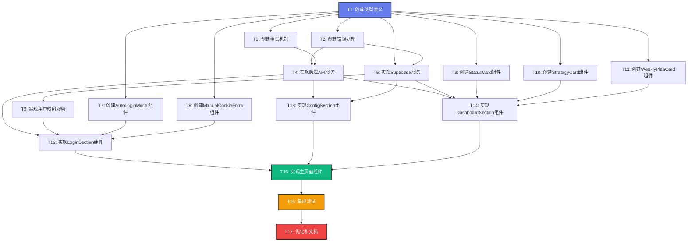

# 小红书自动化系统集成 - 任务拆分文档

> **基于**：DESIGN_xiaohongshu_integration.md  
> **状态**：📋 任务拆分完成，准备执行  
> **日期**：2025-10-31

---

## 🎯 任务拆分原则

1. **原子性**：每个任务独立完成，可单独测试
2. **依赖清晰**：明确前置依赖，按顺序执行
3. **可验证**：每个任务有明确的验收标准
4. **复杂度可控**：单个任务不超过 1 小时

---

## 📊 任务依赖关系图



---

## 📝 任务详细定义

### **T1: 创建 TypeScript 类型定义**

**文件**：`src/types/xiaohongshu.ts`

**输入契约**：
- 无前置依赖

**输出契约**：
- 完整的 TypeScript 接口定义
- 导出所有类型供其他模块使用

**实现内容**：
```typescript
// 需要定义的接口：
- UserMapping
- UserProfile
- LoginStatus
- QRCodeData
- AutomationStatus
- ContentStrategy
- WeeklyPlan
- DayPlan
- DailyTask
- ActivityLog
- APIResponse<T>
- ProductConfig
```

**验收标准**：
- [ ] 所有接口定义完整
- [ ] 类型导出正确
- [ ] 无 TypeScript 编译错误

**预计时间**：20 分钟

---

### **T2: 创建错误处理模块**

**文件**：`src/lib/xiaohongshu-errors.ts`

**输入契约**：
- 无前置依赖

**输出契约**：
- 自定义错误类
- 错误类型枚举
- 错误处理工具函数

**实现内容**：
```typescript
- XiaohongshuError (基类)
- NetworkError
- TimeoutError
- AuthenticationError
- ValidationError
- APIError
```

**验收标准**：
- [ ] 所有错误类定义完整
- [ ] 错误继承关系正确
- [ ] 可被正常 throw 和 catch

**预计时间**：15 分钟

---

### **T3: 创建重试机制模块**

**文件**：`src/lib/xiaohongshu-retry.ts`

**输入契约**：
- 无前置依赖

**输出契约**：
- `retryWithBackoff` 函数
- `RetryOptions` 接口
- 工具函数 `sleep`

**实现内容**：
```typescript
- 指数退避算法
- 可配置重试次数
- 可配置延迟时间
- 重试回调钩子
```

**验收标准**：
- [ ] 重试逻辑正确
- [ ] 延迟计算准确
- [ ] 回调正常触发
- [ ] 单元测试通过

**预计时间**：20 分钟

---

### **T4: 实现后端 API 服务**

**文件**：`src/lib/xiaohongshu-backend-api.ts`

**输入契约**：
- T1: 类型定义
- T2: 错误处理
- T3: 重试机制

**输出契约**：
- `XiaohongshuBackendAPI` 类
- 所有 API 方法封装完整
- 统一错误处理
- 超时控制

**实现内容**：
```typescript
核心方法：
- checkLoginStatus()
- autoLogin()
- submitManualCookies()
- autoImportCookies()
- checkLogoutStatus()
- startAutoOperation()
- getAutomationStatus()
- getContentStrategy()
- getWeeklyPlan()
- healthCheck()

辅助方法：
- request() - 通用请求封装
```

**验收标准**：
- [ ] 所有方法实现完整
- [ ] 请求超时控制正常
- [ ] 错误处理完善
- [ ] 类型定义准确
- [ ] 可手动测试（curl）

**预计时间**：40 分钟

---

### **T5: 实现 Supabase 数据服务**

**文件**：`src/lib/xiaohongshu-supabase.ts`

**输入契约**：
- T1: 类型定义
- T2: 错误处理
- 现有 `src/lib/supabase.ts`

**输出契约**：
- `XiaohongshuSupabaseService` 类
- 所有数据库操作方法
- RLS 策略兼容

**实现内容**：
```typescript
用户映射：
- getUserMapping()
- createUserMapping()

用户配置：
- getUserProfile()
- saveUserProfile()

自动化状态：
- getAutomationStatus()
- saveAutomationStatus()

内容策略：
- getContentStrategy()
- saveContentStrategy()

周计划：
- getWeeklyPlan()
- getCurrentWeekPlan()
- saveWeeklyPlan()

活动日志：
- addActivityLog()
- getActivityLogs()
```

**验收标准**：
- [ ] 所有方法实现完整
- [ ] 数据库操作正确
- [ ] RLS 策略通过
- [ ] 错误处理完善
- [ ] 单元测试通过

**预计时间**：45 分钟

---

### **T6: 实现用户映射服务**

**文件**：`src/lib/xiaohongshu-user-mapping.ts`

**输入契约**：
- T5: Supabase 服务

**输出契约**：
- `UserMappingService` 类
- UUID → xhs_user_id 转换逻辑
- 自动创建映射

**实现内容**：
```typescript
- generateXhsUserId() - 生成规则
- getOrCreateMapping() - 获取或创建
- validateMapping() - 验证映射
```

**验收标准**：
- [ ] ID 生成规则正确
- [ ] 映射创建成功
- [ ] 重复调用幂等
- [ ] 单元测试通过

**预计时间**：20 分钟

---

### **T7: 创建 AutoLoginModal 组件**

**文件**：`src/components/xiaohongshu/AutoLoginModal.tsx`

**输入契约**：
- T1: 类型定义
- shadcn/ui 组件库

**输出契约**：
- 二维码显示弹窗组件
- 轮询检查登录状态
- 状态提示

**实现内容**：
```typescript
Props:
- isOpen: boolean
- qrCode: string | null
- xhsUserId: string
- onLoginSuccess: () => void
- onClose: () => void

功能：
- 显示二维码图片
- 每3秒轮询检查
- 登录成功自动关闭
- 超时提示
```

**验收标准**：
- [ ] 二维码正常显示
- [ ] 轮询逻辑正确
- [ ] 关闭功能正常
- [ ] UI 美观适配

**预计时间**：30 分钟

---

### **T8: 创建 ManualCookieForm 组件**

**文件**：`src/components/xiaohongshu/ManualCookieForm.tsx`

**输入契约**：
- T1: 类型定义
- shadcn/ui 组件库

**输出契约**：
- Cookie 输入表单组件
- 提交和验证逻辑

**实现内容**：
```typescript
Props:
- xhsUserId: string
- onSubmitSuccess: () => void
- onCancel: () => void

功能：
- Cookie 输入框
- 格式验证
- 提交处理
- 错误提示
```

**验收标准**：
- [ ] 表单验证正确
- [ ] 提交逻辑正常
- [ ] 错误提示友好
- [ ] UI 美观适配

**预计时间**：25 分钟

---

### **T9: 创建 StatusCard 组件**

**文件**：`src/components/xiaohongshu/StatusCard.tsx`

**输入契约**：
- T1: 类型定义
- shadcn/ui 组件库

**输出契约**：
- 状态卡片展示组件

**实现内容**：
```typescript
Props:
- status: AutomationStatus
- className?: string

功能：
- 显示运行状态
- 显示在线时长
- 显示下次任务时间
- 状态指示灯动画
```

**验收标准**：
- [ ] 数据显示正确
- [ ] 动画效果流畅
- [ ] 响应式布局
- [ ] UI 美观

**预计时间**：20 分钟

---

### **T10: 创建 StrategyCard 组件**

**文件**：`src/components/xiaohongshu/StrategyCard.tsx`

**输入契约**：
- T1: 类型定义
- shadcn/ui 组件库

**输出契约**：
- 内容策略展示组件

**实现内容**：
```typescript
Props:
- strategy: ContentStrategy
- className?: string

功能：
- 显示关键主题
- 显示热门话题
- 显示推荐标签
- 显示最佳时间
```

**验收标准**：
- [ ] 数据显示正确
- [ ] 标签美观排列
- [ ] 响应式布局
- [ ] UI 美观

**预计时间**：20 分钟

---

### **T11: 创建 WeeklyPlanCard 组件**

**文件**：`src/components/xiaohongshu/WeeklyPlanCard.tsx`

**输入契约**：
- T1: 类型定义
- shadcn/ui 组件库

**输出契约**：
- 周计划展示组件

**实现内容**：
```typescript
Props:
- weeklyPlan: WeeklyPlan
- className?: string

功能：
- 显示每日计划
- 显示任务状态
- 状态图标
- 时间轴布局
```

**验收标准**：
- [ ] 数据显示正确
- [ ] 状态图标准确
- [ ] 时间轴美观
- [ ] 响应式布局

**预计时间**：25 分钟

---

### **T12: 实现 LoginSection 组件**

**文件**：`src/components/xiaohongshu/LoginSection.tsx`

**输入契约**：
- T4: 后端 API 服务
- T6: 用户映射服务
- T7: AutoLoginModal
- T8: ManualCookieForm

**输出契约**：
- 登录检查和登录引导组件
- 完整登录流程

**实现内容**：
```typescript
Props:
- xhsUserId: string
- onLoginSuccess: () => void
- onError: (error: string) => void

功能：
- 检查登录状态
- 自动同步Cookie
- 显示登录选项
- 二维码登录
- 手动Cookie登录
- 退出保护倒计时
```

**验收标准**：
- [ ] 登录检查正确
- [ ] 自动同步成功
- [ ] 二维码登录正常
- [ ] 手动登录正常
- [ ] 状态切换流畅
- [ ] 错误处理完善

**预计时间**：50 分钟

---

### **T13: 实现 ConfigSection 组件**

**文件**：`src/components/xiaohongshu/ConfigSection.tsx`

**输入契约**：
- T4: 后端 API 服务
- T5: Supabase 服务
- shadcn/ui 表单组件

**输出契约**：
- 产品配置表单组件
- 配置保存和提交

**实现内容**：
```typescript
Props:
- supabaseUuid: string
- xhsUserId: string
- initialConfig?: UserProfile
- onConfigSaved: (profile: UserProfile) => void
- onStartOperation: () => void

功能：
- 产品信息表单
- 表单验证
- 保存配置
- 启动自动运营
- 加载已有配置
```

**验收标准**：
- [ ] 表单验证正确
- [ ] 配置保存成功
- [ ] 启动运营成功
- [ ] 加载配置正常
- [ ] 错误提示友好
- [ ] UI 美观

**预计时间**：45 分钟

---

### **T14: 实现 DashboardSection 组件**

**文件**：`src/components/xiaohongshu/DashboardSection.tsx`

**输入契约**：
- T4: 后端 API 服务
- T5: Supabase 服务
- T9: StatusCard
- T10: StrategyCard
- T11: WeeklyPlanCard

**输出契约**：
- 运营仪表盘组件
- 实时数据更新

**实现内容**：
```typescript
Props:
- supabaseUuid: string
- xhsUserId: string
- automationStatus: AutomationStatus | null
- contentStrategy: ContentStrategy | null
- weeklyPlan: WeeklyPlan | null
- onRefresh: () => void

功能：
- 显示运营状态
- 显示内容策略
- 显示周计划
- 轮询更新（每5秒）
- 手动刷新
- 页面不可见时暂停轮询
```

**验收标准**：
- [ ] 数据展示正确
- [ ] 轮询逻辑正常
- [ ] 刷新功能正常
- [ ] 性能良好
- [ ] 响应式布局
- [ ] UI 美观

**预计时间**：50 分钟

---

### **T15: 实现主页面组件**

**文件**：`src/pages/XiaohongshuAutomation.tsx`

**输入契约**：
- T12: LoginSection
- T13: ConfigSection
- T14: DashboardSection
- authService

**输出契约**：
- 完整的小红书自动化页面
- 步骤式流程控制
- 状态管理

**实现内容**：
```typescript
功能：
- 用户认证检查
- 生成用户映射
- 步骤流程控制
- 全局状态管理
- 错误处理
- 加载状态
- 页面头部和导航
```

**验收标准**：
- [ ] 认证检查正常
- [ ] 映射生成成功
- [ ] 步骤切换流畅
- [ ] 状态管理正确
- [ ] 错误处理完善
- [ ] 加载状态明确
- [ ] 整体 UI 美观

**预计时间**：60 分钟

---

### **T16: 集成测试**

**输入契约**：
- T15: 主页面完成
- 所有子任务完成

**输出契约**：
- 完整功能测试通过
- 测试报告

**实现内容**：
```
测试场景：
1. 用户首次访问
2. 登录流程完整性
3. 配置保存和读取
4. 自动运营启动
5. 仪表盘数据更新
6. 错误恢复场景
7. 移动端适配
8. 性能测试
```

**验收标准**：
- [ ] 所有功能正常
- [ ] 无严重 bug
- [ ] 性能符合要求
- [ ] 移动端正常
- [ ] 错误处理完善

**预计时间**：60 分钟

---

### **T17: 优化和文档**

**输入契约**：
- T16: 集成测试通过

**输出契约**：
- 性能优化完成
- 文档更新
- 部署准备

**实现内容**：
```
优化：
- 代码精简
- 性能优化
- 样式调整
- 错误提示优化

文档：
- 更新 README
- 添加使用说明
- API 文档
- 故障排查指南
```

**验收标准**：
- [ ] 代码质量良好
- [ ] 性能优化完成
- [ ] 文档完整清晰
- [ ] 准备好部署

**预计时间**：45 分钟

---

## 📊 任务汇总

| 任务ID | 任务名称 | 预计时间 | 依赖任务 | 优先级 |
|--------|---------|---------|---------|--------|
| T1 | 创建类型定义 | 20分钟 | 无 | P0 |
| T2 | 创建错误处理 | 15分钟 | 无 | P0 |
| T3 | 创建重试机制 | 20分钟 | 无 | P0 |
| T4 | 实现后端API服务 | 40分钟 | T1,T2,T3 | P0 |
| T5 | 实现Supabase服务 | 45分钟 | T1,T2 | P0 |
| T6 | 实现用户映射服务 | 20分钟 | T5 | P0 |
| T7 | 创建AutoLoginModal | 30分钟 | T1 | P1 |
| T8 | 创建ManualCookieForm | 25分钟 | T1 | P1 |
| T9 | 创建StatusCard | 20分钟 | T1 | P1 |
| T10 | 创建StrategyCard | 20分钟 | T1 | P1 |
| T11 | 创建WeeklyPlanCard | 25分钟 | T1 | P1 |
| T12 | 实现LoginSection | 50分钟 | T4,T6,T7,T8 | P0 |
| T13 | 实现ConfigSection | 45分钟 | T4,T5 | P0 |
| T14 | 实现DashboardSection | 50分钟 | T4,T5,T9,T10,T11 | P0 |
| T15 | 实现主页面组件 | 60分钟 | T12,T13,T14 | P0 |
| T16 | 集成测试 | 60分钟 | T15 | P0 |
| T17 | 优化和文档 | 45分钟 | T16 | P1 |

**总计时间**：约 9.5 小时

---

## 🎯 执行顺序建议

### Phase 1: 基础设施（1.5小时）
```
T1 → T2 → T3 → 并行执行 (T4, T5) → T6
```

### Phase 2: UI 组件（2小时）
```
并行执行 (T7, T8, T9, T10, T11)
```

### Phase 3: 业务组件（2.5小时）
```
并行执行 (T12, T13) → T14
```

### Phase 4: 集成和测试（2.5小时）
```
T15 → T16 → T17
```

---

## ✅ 验收清单

### 功能验收
- [ ] 用户登录后自动生成 xhs_user_id
- [ ] 登录状态检查正常
- [ ] 二维码登录功能正常
- [ ] 手动Cookie导入功能正常
- [ ] 产品配置保存正常
- [ ] 自动运营启动成功
- [ ] 仪表盘实时更新
- [ ] 所有数据保存到Supabase

### 性能验收
- [ ] 首次加载 < 2秒
- [ ] API响应 < 1秒
- [ ] 轮询不卡顿
- [ ] 移动端流畅

### 用户体验验收
- [ ] 无需手动输入ID
- [ ] 错误提示清晰
- [ ] 加载状态明确
- [ ] 移动端适配良好
- [ ] 风格与prome-platform一致

---

## 🚀 准备开始执行

所有任务已拆分完成，依赖关系明确，现在可以开始 **Automate 阶段** - 逐步实施每个任务。

---

**文档创建时间**：2025-10-31  
**创建人**：AI Assistant  
**状态**：✅ 任务拆分完成，准备执行
