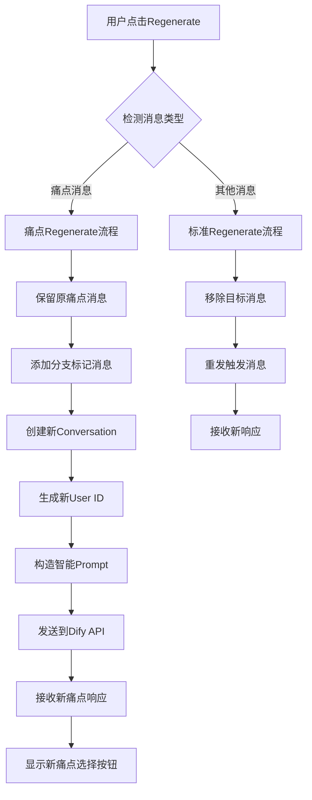
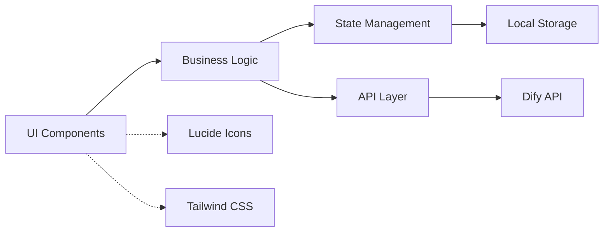
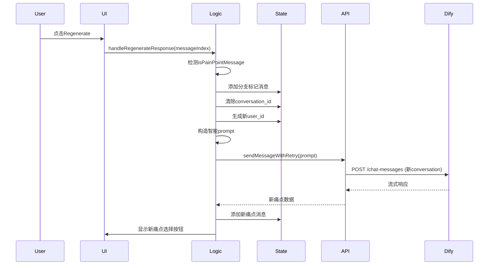

# DESIGN_痛点Regenerate.md

## 整体架构图



## 分层设计和核心组件

### UI层 (DifyChatInterface.tsx)
- **RegenerateButton组件**: 检测消息类型，调用相应regenerate逻辑
- **BranchMarker组件**: 显示分支标识和状态
- **PainPointButtons组件**: 为新生成的痛点显示选择按钮

### 业务逻辑层
- **handleRegenerateResponse()**: 主要regenerate路由逻辑
- **regeneratePainPointsWithBranch()**: 专门处理痛点regenerate
- **handleWorkflowButtonClick()**: 处理工作流按钮点击

### API层 (server.js)
- **现有API**: 继续使用`/api/dify/:conversationId/stream`
- **无需修改**: 新conversation创建通过现有逻辑处理

## 模块依赖关系图



## 接口契约定义

### handleRegenerateResponse接口
```typescript
interface RegenerateParams {
  messageIndex: number;
  messageType: 'standard' | 'pain_point';
}

interface RegenerateResult {
  success: boolean;
  newConversationId?: string;
  branchMarker?: Message;
  error?: string;
}
```

### 分支标记消息格式
```typescript
interface BranchMessage extends Message {
  role: 'system';
  content: string; // "🔀 Generating Alternative Pain Points..."
  id: string;     // `branch_${timestamp}`
}
```

## 数据流向图



## 异常处理策略

### 错误场景处理
1. **Dify API调用失败**: 保留原消息，显示错误提示
2. **新conversation创建失败**: 回滚到原状态
3. **用户ID生成冲突**: 重新生成带时间戳的ID
4. **Prompt路由失败**: 记录详细错误，提供手动重试选项

### 容错机制
- **自动重试**: 使用现有的`sendMessageWithRetry`机制
- **状态恢复**: 失败时恢复到regenerate前的消息状态
- **用户反馈**: 清晰的loading状态和错误提示