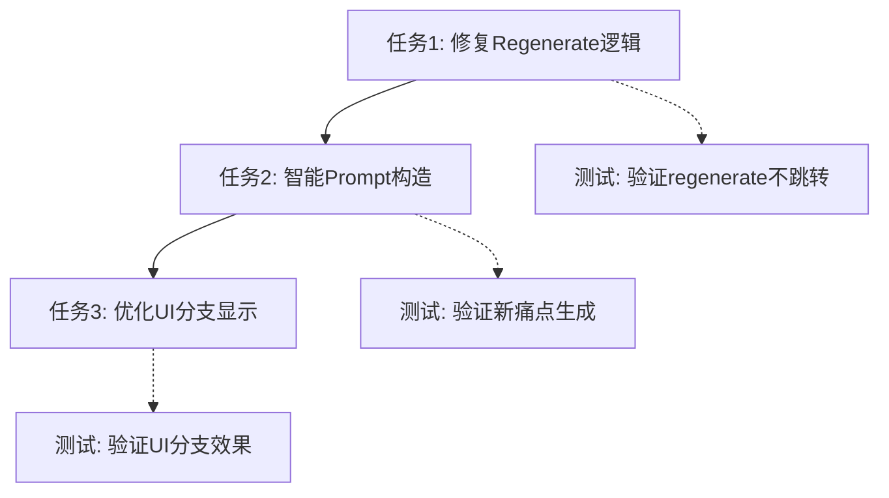

# TASK_痛点Regenerate.md

## 原子任务拆分

### 任务1: 修复当前Regenerate逻辑
**输入契约**:
- 现有的handleRegenerateResponse函数
- 现有的痛点检测逻辑

**输出契约**:
- 修复的regenerate函数，能正确处理痛点消息
- 不破坏现有的标准regenerate功能

**实现约束**:
- 使用现有的TypeScript接口
- 保持现有的错误处理模式
- 遵循现有的代码风格

**验收标准**:
- 痛点regenerate不再跳到LLM3
- 标准消息regenerate保持正常工作
- 无TypeScript编译错误

### 任务2: 实现智能Prompt构造
**输入契约**:
- 原有痛点消息内容
- 历史用户输入消息
- 产品信息提取逻辑

**输出契约**:
- 构造能绕过信息收集阶段的智能prompt
- 确保Dify直接路由到痛点生成阶段

**实现约束**:
- Prompt必须用中文
- 必须包含所有必要的产品信息
- 格式要能被Dify工作流正确识别

**验收标准**:
- 新conversation能直接生成痛点
- 生成的痛点与原痛点内容不同
- 新痛点格式包含正确的JSON结构

### 任务3: 优化UI分支显示
**输入契约**:
- 现有的消息渲染逻辑
- shadcn/ui组件库
- Lucide图标系统

**输出契约**:
- 清晰的分支标记组件
- 新痛点的选择按钮
- 改进的用户体验

**实现约束**:
- 使用现有的UI组件模式
- 保持与Tailwind CSS类的一致性
- 图标使用Lucide React

**验收标准**:
- 分支标记清晰可见
- 新痛点有对应的选择按钮
- UI响应良好，无样式冲突

## 任务依赖关系图

## 技术实现细节

### 关键代码修改点
1. **DifyChatInterface.tsx**: `handleRegenerateResponse`函数
2. **消息渲染逻辑**: 添加分支标记和新按钮
3. **Prompt工程**: 构造智能路由prompt

### 测试策略
- **单元测试**: prompt构造逻辑
- **集成测试**: 完整的regenerate流程
- **用户测试**: 实际工作流验证