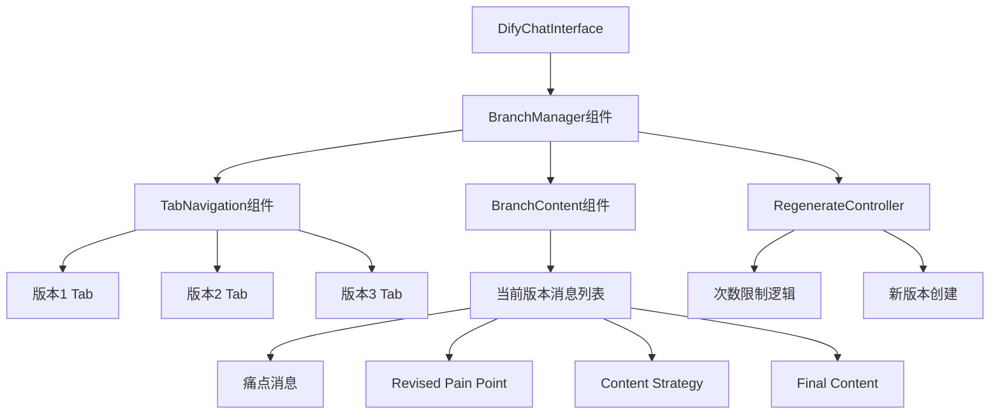
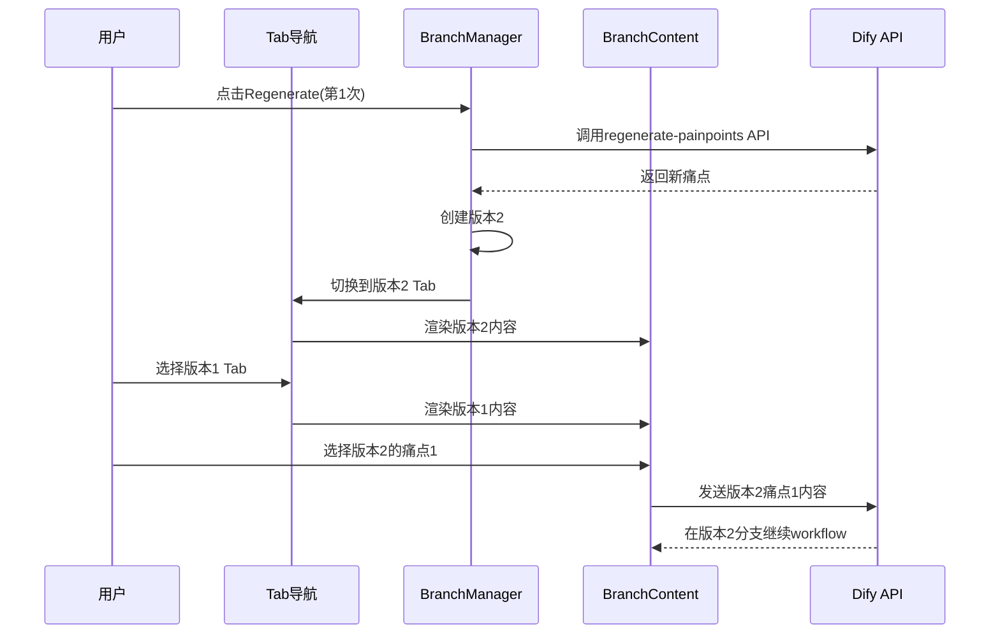

# DESIGN_痛点分支展示.md

## 🏗️ 整体架构图



## 🔧 核心组件设计

### 1. BranchManager (分支管理器)
**职责**: 管理痛点版本和分支状态
```typescript
interface BranchManagerProps {
  messages: Message[];
  onVersionSwitch: (versionId: string) => void;
  onRegenerateCount: number;
}
```

### 2. TabNavigation (标签导航)
**设计**: 
- 水平标签布局，显眼易操作
- 激活标签高亮显示
- 显示regenerate次数状态

**样式设计**:
```css
.tab-active: bg-blue-500 text-white
.tab-inactive: bg-gray-200 text-gray-700 hover:bg-gray-300
.tab-disabled: bg-gray-100 text-gray-400 cursor-not-allowed
```

### 3. BranchContent (分支内容)
**职责**: 渲染当前版本的完整workflow消息
- 痛点生成消息 + 选择按钮
- Revised pain point + Generate Strategy按钮
- Content Strategy + Confirm按钮  
- Final Content + Regenerate按钮

### 4. RegenerateController (Regenerate控制器)
**功能**:
- 跟踪regenerate次数 (0-3)
- 控制regenerate按钮的可用性
- 创建新版本时自动切换

## 📊 数据流设计



## 🎯 状态管理设计

### 分支状态结构
```typescript
interface BranchState {
  versions: Array<{
    id: string;
    label: string; // "版本1", "版本2", "版本3"
    messages: Message[];
    isActive: boolean;
  }>;
  regenerateCount: number; // 0-3
  maxRegenerateCount: 3;
}
```

### 消息分组逻辑
```typescript
// 将messages按版本分组
function groupMessagesByVersion(messages: Message[]): PainPointVersion[] {
  // 1. 识别痛点生成消息边界
  // 2. 将每组痛点及其后续workflow消息归为一个版本
  // 3. 返回版本化的消息分组
}
```

## 🔗 接口设计

### 组件接口
```typescript
interface PainPointBranchManagerProps {
  messages: Message[];
  currentVersionId: string;
  regenerateCount: number;
  onVersionSwitch: (versionId: string) => void;
  onRegenerateRequest: () => void;
}
```

### 状态管理接口
```typescript
interface UsePainPointBranches {
  versions: PainPointVersion[];
  activeVersion: PainPointVersion | null;
  regenerateCount: number;
  canRegenerate: boolean;
  switchVersion: (versionId: string) => void;
  addNewVersion: (messages: Message[]) => void;
}
```

## 🎨 UI设计方案

### Tab导航布局
```
[版本1] [版本2] [版本3*] [+ Regenerate (1/3)]
```
- `*` 表示当前激活版本
- Regenerate按钮显示剩余次数
- 达到3次后按钮变灰禁用

### 分支内容区
- 只显示当前激活版本的消息
- 保持现有的消息渲染样式
- 工作流按钮只对当前版本有效