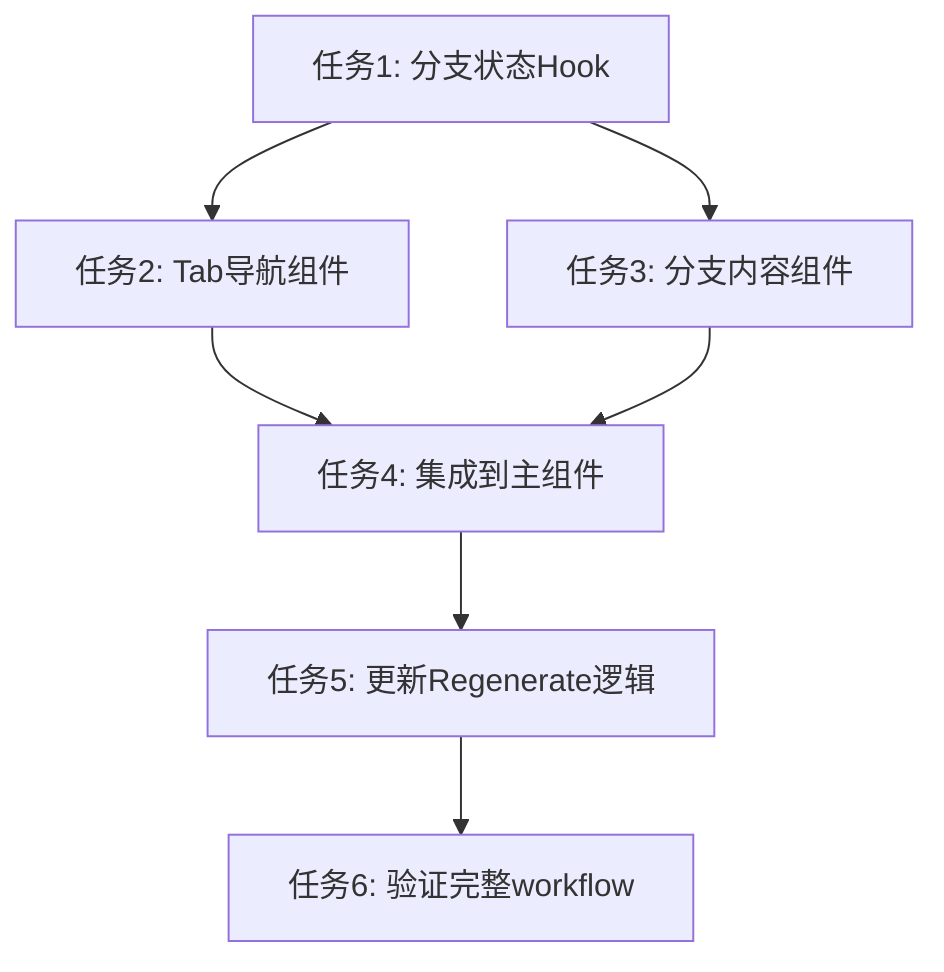

# TASK_痛点分支展示.md

## 🎯 原子任务拆分

### 任务1: 创建分支状态管理Hook
**输入契约**:
- 前置依赖: React环境，现有messages状态
- 输入数据: Message数组
- 环境依赖: TypeScript支持

**输出契约**:
- 输出数据: usePainPointBranches hook
- 交付物: /src/hooks/usePainPointBranches.ts
- 验收标准: 能正确分组消息，管理版本状态

**实现约束**:
- 技术栈: React hooks
- 接口规范: 返回版本数组和操作函数
- 质量要求: 包含版本切换和regenerate计数逻辑

### 任务2: 创建Tab导航组件
**输入契约**:
- 前置依赖: 任务1完成，有版本数据结构
- 输入数据: 版本列表和当前版本ID
- 环境依赖: Tailwind CSS, Lucide图标

**输出契约**:
- 输出数据: PainPointTabNavigation组件
- 交付物: /src/components/chat/PainPointTabNavigation.tsx
- 验收标准: 显示版本标签，支持切换，显示regenerate状态

**实现约束**:
- 技术栈: React + TypeScript + Tailwind
- 接口规范: 遵循现有组件模式
- 质量要求: 响应式设计，accessible

### 任务3: 创建分支内容组件
**输入契约**:
- 前置依赖: 任务1和2完成
- 输入数据: 当前版本的消息列表
- 环境依赖: 现有消息渲染组件

**输出契约**:
- 输出数据: PainPointBranchContent组件
- 交付物: /src/components/chat/PainPointBranchContent.tsx
- 验收标准: 渲染版本消息，保持现有样式

**实现约束**:
- 技术栈: React + TypeScript
- 接口规范: 复用现有消息渲染逻辑
- 质量要求: 性能优化，避免不必要重渲染

### 任务4: 集成到DifyChatInterface
**输入契约**:
- 前置依赖: 任务1-3完成
- 输入数据: 现有DifyChatInterface组件
- 环境依赖: 现有state管理

**输出契约**:
- 输出数据: 更新的DifyChatInterface组件
- 交付物: 修改现有组件文件
- 验收标准: 痛点消息使用分支展示，其他消息正常显示

**实现约束**:
- 技术栈: 保持现有技术栈
- 接口规范: 不破坏现有消息流逻辑
- 质量要求: 向下兼容，渐进式增强

### 任务5: 更新Regenerate逻辑
**输入契约**:
- 前置依赖: 任务4完成，分支系统集成
- 输入数据: 现有regenerate函数
- 环境依赖: 后端API支持

**输出契约**:
- 输出数据: 版本化的regenerate处理
- 交付物: 更新的handleRegenerateResponse函数
- 验收标准: 新版本自动创建并切换，限制3次

**实现约束**:
- 技术栈: 保持现有API调用方式
- 接口规范: 复用现有后端endpoint
- 质量要求: 错误处理，状态同步

### 任务6: 验证完整分支workflow
**输入契约**:
- 前置依赖: 任务1-5完成
- 输入数据: 完整用户交互流程
- 环境依赖: 本地开发环境

**输出契约**:
- 输出数据: 端到端功能验证
- 交付物: 测试通过的分支系统
- 验收标准: 多版本痛点→选择→分支workflow→最终文案全流程

## 📊 任务依赖关系图

## 🎯 复杂度评估
- **任务1**: 中复杂度 - 消息分组逻辑较复杂
- **任务2**: 低复杂度 - 标准Tab组件
- **任务3**: 低复杂度 - 复用现有消息渲染
- **任务4**: 中复杂度 - 需要重构现有逻辑
- **任务5**: 中复杂度 - regenerate状态管理
- **任务6**: 低复杂度 - 功能验证
- **总体**: 中高复杂度，需要分步骤小心实施