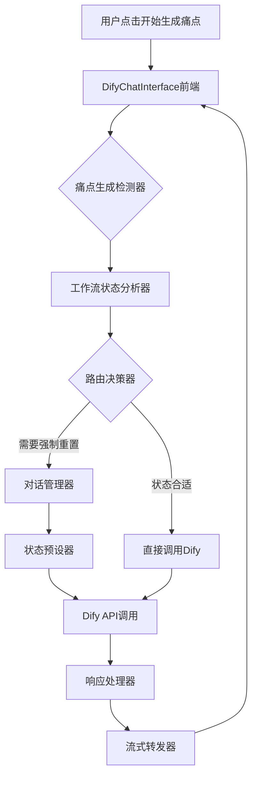
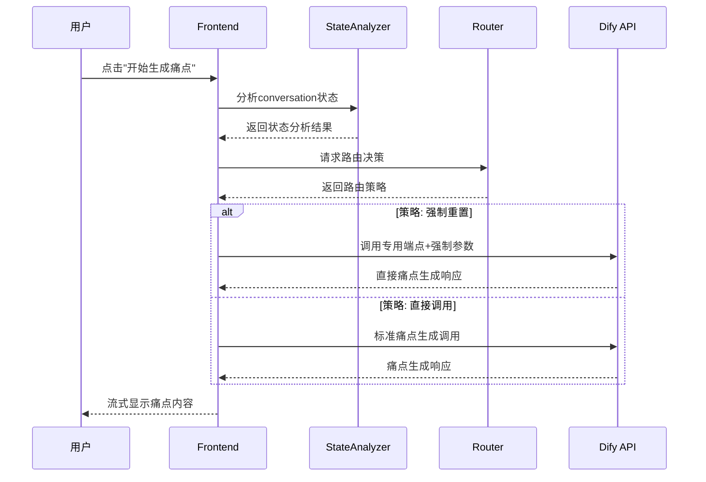

# DESIGN_痛点路由问题.md

## 系统架构设计

### 整体架构图


### 核心组件设计

#### 1. 工作流状态分析器 (StateAnalyzer)
**职责**: 分析当前conversation的工作流状态
```typescript
interface WorkflowState {
  currentStage: 'info_collection' | 'painpoint_generation' | 'content_strategy' | 'final_content';
  completeness: number;
  hasCollectedInfo: boolean;
  needsReset: boolean;
}

function analyzeWorkflowState(conversationId: string, messages: Message[]): WorkflowState
```

#### 2. 状态预设器 (StatePrep)
**职责**: 为Dify工作流预设正确的状态变量
```typescript
interface DifyInputs {
  product_info: string;
  completeness: "4";
  stage: "painpoint_generation";
  ready_for_painpoints: "true";
  force_painpoint_mode: "true"; // 新增强制标志
}
```

#### 3. 路由决策器 (Router)
**职责**: 基于状态分析决定调用策略
```typescript
type RoutingStrategy = 
  | { type: 'direct_call', reason: 'clean_state' }
  | { type: 'force_reset', reason: 'polluted_state' }
  | { type: 'new_conversation', reason: 'unrecoverable_state' };
```

### 分层设计

#### API层 (server.js)
```javascript
// 增强的专用端点
app.post('/api/dify/:conversationId/start-painpoints', async (req, res) => {
  // 1. 状态分析
  const workflowState = await analyzeConversationState(conversationId);
  
  // 2. 路由决策
  const strategy = determineRoutingStrategy(workflowState);
  
  // 3. 执行策略
  await executeRoutingStrategy(strategy, req, res);
});
```

#### 前端交互层 (DifyChatInterface.tsx)
```typescript
// 智能痛点生成按钮
const handlePainPointGeneration = async () => {
  try {
    // 预分析本地状态
    const needsReset = shouldResetConversation();
    
    // 调用增强端点
    const response = await fetch(`/api/dify/${conversationId}/start-painpoints`, {
      method: 'POST',
      headers: {'Content-Type': 'application/json'},
      body: JSON.stringify({
        productInfo,
        userId,
        forceMode: needsReset,
        stream: true
      })
    });
    
    await handleWorkflowStream(response, userMessage);
  } catch (error) {
    handlePainPointGenerationError(error);
  }
};
```

### 接口契约定义

#### 1. 状态分析接口
```typescript
interface ConversationStateAPI {
  analyze(conversationId: string): Promise<WorkflowState>;
  shouldReset(state: WorkflowState): boolean;
  getProductInfo(messages: Message[]): string;
}
```

#### 2. Dify调用接口
```typescript
interface EnhancedDifyRequest {
  inputs: DifyInputs;
  query: string;
  response_mode: 'streaming';
  user: string;
  conversation_id?: string;
  files?: any[];
}
```

### 数据流向图


### 异常处理策略

#### 1. Dify状态冲突
- **检测**: 响应内容包含"COMPLETENESS"或信息收集关键词
- **处理**: 自动触发conversation重置并重新调用
- **用户体验**: 显示"正在优化工作流状态..."消息

#### 2. API调用失败
- **检测**: HTTP错误或超时
- **处理**: 降级到标准端点，记录错误信息
- **用户体验**: 显示具体错误信息和建议操作

#### 3. 状态分析失败
- **检测**: 无法解析conversation状态
- **处理**: 使用保守策略，创建新conversation
- **用户体验**: 透明说明并提供手动选项

### 与现有系统集成

#### 1. 保持兼容性
- 不修改现有的handleWorkflowButtonClick核心逻辑
- 复用现有的SSE流式响应处理
- 保持现有的conversation ID管理

#### 2. 架构对齐
- 遵循现有的API代理模式
- 使用现有的错误处理机制
- 保持现有的日志记录格式

### 技术约束
1. **Dify API限制**: conversation变量无法重置，需要通过inputs预设
2. **流式响应要求**: 必须保持SSE格式的实时响应
3. **状态一致性**: frontend和backend状态必须同步
4. **现有功能保护**: 不能影响其他工作流阶段的正常运行

### 验证策略
1. **单元测试**: 状态分析器和路由决策器的核心逻辑
2. **集成测试**: 完整的痛点生成流程
3. **边界测试**: 各种conversation状态的处理
4. **用户体验测试**: 确保流程顺畅无卡顿