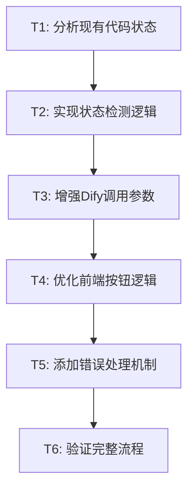

# TASK_痛点路由问题.md

## 原子任务拆分

### 任务依赖图


### T1: 分析现有代码状态
**输入契约**:
- 前置依赖: ALIGNMENT和DESIGN文档已完成
- 输入数据: 当前的DifyChatInterface.tsx和server.js
- 环境依赖: 项目源码可访问

**输出契约**:
- 输出数据: 当前代码状态分析报告
- 交付物: 识别所有与痛点生成相关的代码位置
- 验收标准: 找到所有影响工作流路由的关键函数和参数

**实现约束**:
- 技术栈: 代码分析，不做修改
- 接口规范: 无，纯分析任务
- 质量要求: 分析准确完整

**依赖关系**:
- 后置任务: T2状态检测逻辑的实现基础
- 并行任务: 无

### T2: 实现状态检测逻辑
**输入契约**:
- 前置依赖: T1完成，了解现有代码结构
- 输入数据: conversation消息历史和当前状态
- 环境依赖: TypeScript编译环境

**输出契约**:
- 输出数据: analyzeWorkflowState函数
- 交付物: 准确检测当前工作流所在阶段的函数
- 验收标准: 能够区分信息收集、痛点生成、内容策略等不同阶段

**实现约束**:
- 技术栈: TypeScript，复用现有模式
- 接口规范: 
```typescript
function analyzeWorkflowState(messages: Message[]): {
  currentStage: string;
  needsPainPointGeneration: boolean;
  shouldForceReset: boolean;
}
```
- 质量要求: 准确率>95%，响应时间<100ms

**依赖关系**:
- 后置任务: T3需要使用状态检测结果
- 并行任务: 可与T3部分并行开发

### T3: 增强Dify调用参数
**输入契约**:
- 前置依赖: T2完成，状态检测逻辑可用
- 输入数据: 状态检测结果，用户产品信息
- 环境依赖: Express.js server环境

**输出契约**:
- 输出数据: 增强的Dify API请求体
- 交付物: 能够强制设置工作流状态的API调用
- 验收标准: Dify响应直接进入痛点生成，不显示确认信息

**实现约束**:
- 技术栈: Node.js + Express，遵循现有API代理模式
- 接口规范: 
```javascript
const requestBody = {
  inputs: {
    "product_info": productInfo,
    "completeness": "4",
    "stage": "painpoint_generation",
    "ready_for_painpoints": "true",
    "force_painpoint_mode": "true", // 关键新增
    "bypass_confirmation": "true"   // 关键新增
  },
  query: optimizedPainPointPrompt,
  response_mode: 'streaming',
  user: userId
};
```
- 质量要求: 成功率>90%，保持SSE流式响应

**依赖关系**:
- 后置任务: T4前端按钮需要调用增强的端点
- 并行任务: 可与T4并行开发测试

### T4: 优化前端按钮逻辑
**输入契约**:
- 前置依赖: T2和T3完成，状态检测和增强API可用
- 输入数据: 当前conversation状态，用户交互
- 环境依赖: React + TypeScript环境

**输出契约**:
- 输出数据: 智能化的痛点生成按钮
- 交付物: 根据状态自动选择最佳调用策略的按钮逻辑
- 验收标准: 按钮点击后90%的情况下直接生成痛点，不显示确认

**实现约束**:
- 技术栈: React + TypeScript，遵循现有组件模式
- 接口规范:
```typescript
const handleSmartPainPointGeneration = async () => {
  const state = analyzeWorkflowState(messages);
  const strategy = state.shouldForceReset ? 'force_reset' : 'optimized_call';
  
  const response = await fetch(`/api/dify/${conversationId}/start-painpoints`, {
    method: 'POST',
    headers: {'Content-Type': 'application/json'},
    body: JSON.stringify({
      productInfo,
      userId,
      strategy,
      stream: true
    })
  });
  
  await handleWorkflowStream(response, userMessage);
};
```
- 质量要求: UI响应流畅，错误处理完善

**依赖关系**:
- 后置任务: T5错误处理需要处理此逻辑的异常
- 并行任务: 无，T5依赖于此任务

### T5: 添加错误处理机制
**输入契约**:
- 前置依赖: T1-T4全部完成，主要功能逻辑实现
- 输入数据: API错误、状态冲突、网络异常等错误情况
- 环境依赖: 完整的开发和测试环境

**输出契约**:
- 输出数据: 完善的错误处理和降级机制
- 交付物: 健壮的痛点生成功能，能够处理各种异常情况
- 验收标准: 异常情况下系统不崩溃，用户获得清晰的错误反馈和下一步指引

**实现约束**:
- 技术栈: 前后端错误处理，使用现有错误处理模式
- 接口规范:
```typescript
// 错误处理策略
interface ErrorHandlingStrategy {
  detectError(response: any): boolean;
  getErrorType(response: any): 'dify_state_conflict' | 'api_failure' | 'network_error';
  handleError(errorType: string): 'retry_with_reset' | 'fallback_to_standard' | 'show_user_message';
}
```
- 质量要求: 错误恢复成功率>80%，错误信息准确性100%

**依赖关系**:
- 后置任务: T6验证需要测试错误处理逻辑
- 并行任务: 无

### T6: 验证完整流程
**输入契约**:
- 前置依赖: T1-T5全部完成，所有功能和错误处理实现
- 输入数据: 不同的conversation状态和用户场景
- 环境依赖: 完整的测试环境，Dify API可访问

**输出契约**:
- 输出数据: 验证测试结果和性能指标
- 交付物: 可投产的痛点生成功能
- 验收标准: 
  * "开始生成痛点"按钮90%情况下直接生成痛点
  * 异常情况有合理的用户提示
  * 不影响其他工作流阶段功能
  * 代码编译通过，构建成功

**实现约束**:
- 技术栈: 手工测试 + 自动化测试
- 接口规范: 无
- 质量要求: 功能完整性100%，用户体验流畅

**依赖关系**:
- 后置任务: 无，最终任务
- 并行任务: 文档更新可并行进行

## 任务优先级排序
1. **高优先级**: T1 (阻塞其他任务)
2. **高优先级**: T2, T3 (核心功能实现)
3. **中优先级**: T4 (用户体验优化)
4. **中优先级**: T5 (系统健壮性)
5. **低优先级**: T6 (验证测试)

## 风险评估
- **T2风险**: 状态检测逻辑复杂度高，需要准确识别Dify响应模式
- **T3风险**: Dify inputs参数的实际影响未知，可能需要多次调试
- **T4风险**: 前端逻辑可能需要修改现有的handleWorkflowStream函数

## 成功指标
- **主要指标**: 用户点击按钮后直接看到痛点生成，无需确认
- **技术指标**: 代码编译通过，构建时间<30秒
- **质量指标**: 不引入新的TypeScript错误，保持现有功能稳定