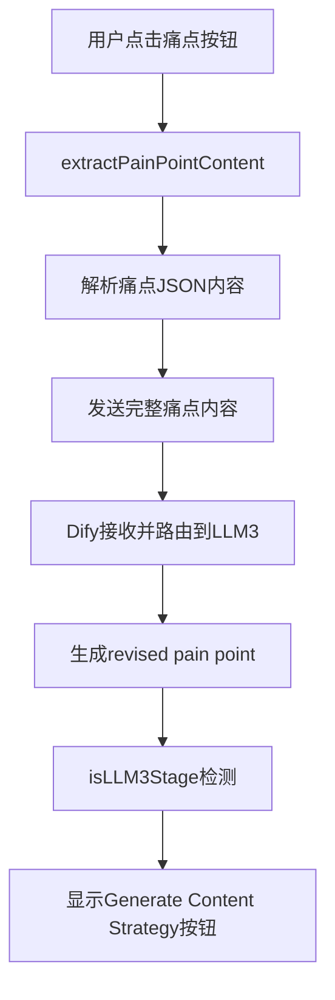
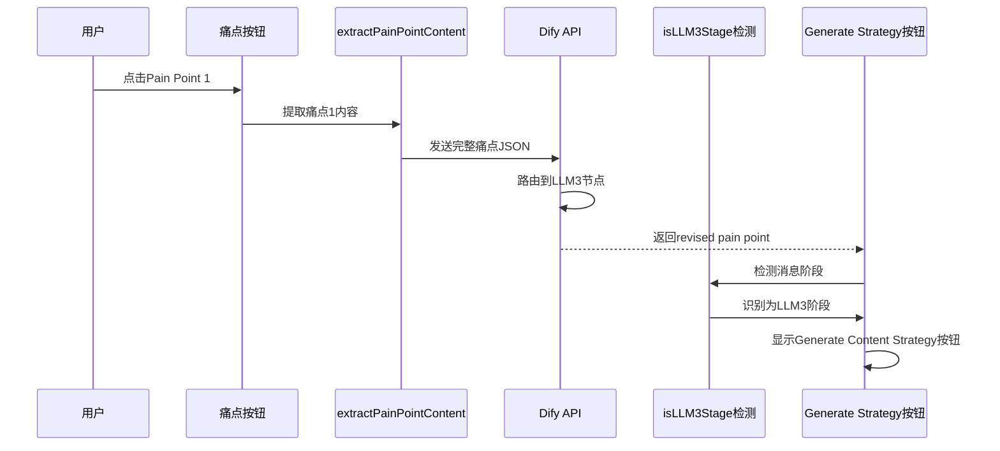

# DESIGN_痛点选择修复.md

## 🏗️ 整体架构图



## 🔧 核心组件设计

### 1. 痛点内容提取器 (extractPainPointContent)
**输入**: 
- content: 包含痛点JSON的AI消息内容
- painPointNumber: 痛点序号(1,2,3)

**输出**: 完整的痛点JSON字符串

**实现逻辑**:
```typescript
// 1. 使用正则匹配提取所有痛点JSON对象
// 2. 根据序号选择对应的痛点
// 3. 返回格式化的JSON字符串
```

### 2. LLM3阶段检测器 (isLLM3Stage)
**检测条件**:
- 用户消息包含完整痛点JSON内容 OR 传统痛点标签
- 当前消息是AI响应
- 消息内容包含痛点相关特征

**更新逻辑**:
```typescript
// 扩展用户痛点选择检测范围
// 包含: '痛点1/2/3' OR '我选择痛点' OR '"problem":'
```

## 📊 数据流向图



## 🔗 接口契约定义

### extractPainPointContent接口
```typescript
function extractPainPointContent(content: string, painPointNumber: number): string
```
- **前置条件**: content包含valid JSON痛点对象
- **后置条件**: 返回对应序号的完整痛点JSON
- **异常处理**: JSON解析失败时返回fallback痛点标签

### isLLM3Stage检测接口  
```typescript
function isLLM3Stage(message: Message): boolean
```
- **前置条件**: message是有效的Message对象
- **检测逻辑**: 用户选择痛点 + AI响应 + 包含痛点特征
- **返回值**: boolean表示是否为LLM3阶段

## 🎯 异常处理策略
1. **JSON解析失败**: 回退到传统痛点标签
2. **阶段检测失败**: 记录调试信息，使用保守检测逻辑
3. **按钮显示异常**: 确保不影响其他工作流阶段