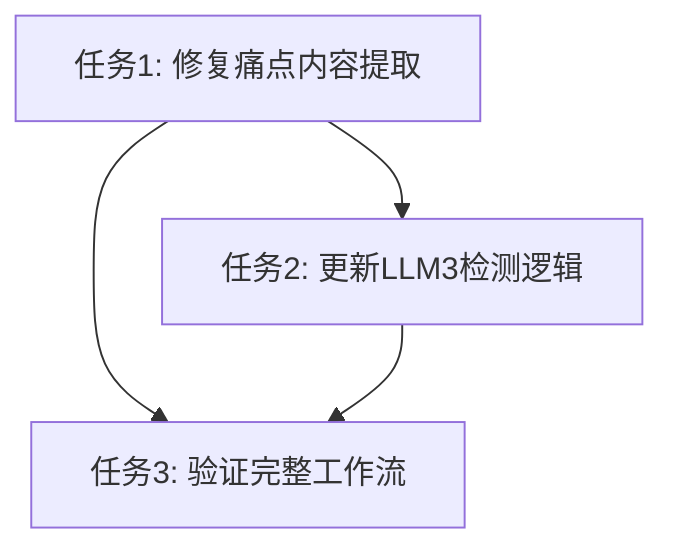

# TASK_痛点选择修复.md

## 🎯 原子任务拆分

### 任务1: 修复痛点内容提取逻辑
**输入契约**:
- 前置依赖: DifyChatInterface.tsx已存在extractPainPointContent函数
- 输入数据: AI生成的包含痛点JSON的消息内容
- 环境依赖: React组件环境

**输出契约**:
- 输出数据: 准确的痛点JSON字符串
- 交付物: 更新的extractPainPointContent函数
- 验收标准: 能正确解析并返回对应序号的痛点内容

**实现约束**:
- 技术栈: TypeScript
- 接口规范: 保持现有函数签名
- 质量要求: 包含错误处理和fallback逻辑

### 任务2: 更新LLM3阶段检测逻辑
**输入契约**:
- 前置依赖: 任务1完成，新的用户消息格式确定
- 输入数据: Message对象和messages数组
- 环境依赖: React组件state

**输出契约**:
- 输出数据: 准确的LLM3阶段判断结果
- 交付物: 更新的isLLM3Stage函数
- 验收标准: 能正确识别痛点选择后的AI响应

**实现约束**:
- 技术栈: TypeScript
- 接口规范: 保持boolean返回值
- 质量要求: 包含调试日志，向下兼容旧格式

### 任务3: 验证完整工作流
**输入契约**:
- 前置依赖: 任务1和2完成
- 输入数据: 完整的用户交互流程
- 环境依赖: 本地开发环境

**输出契约**:
- 输出数据: 工作流各阶段正常运行结果
- 交付物: 验证通过的功能
- 验收标准: 痛点选择→revised pain point→按钮显示→内容策略生成全流程成功

## 📊 任务依赖关系图

## 🎯 复杂度评估
- **任务1**: 低复杂度 - 简单的JSON解析逻辑
- **任务2**: 中复杂度 - 需要理解消息匹配逻辑  
- **任务3**: 低复杂度 - 功能验证测试
- **总体**: 中等复杂度，风险可控